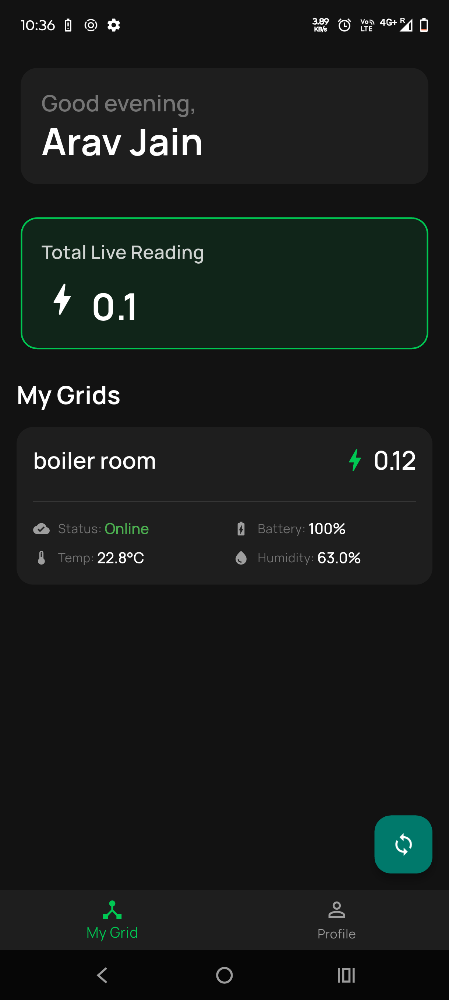
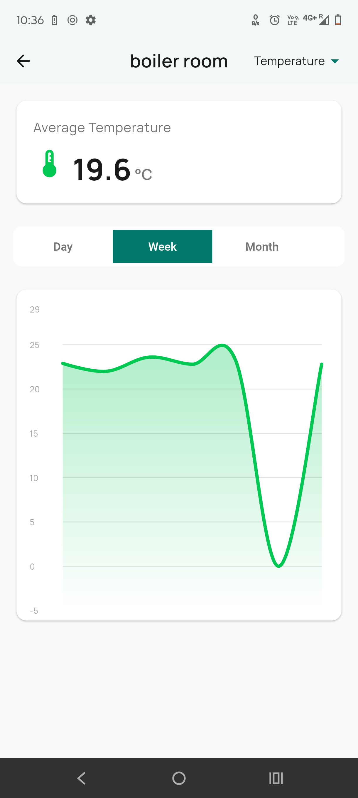
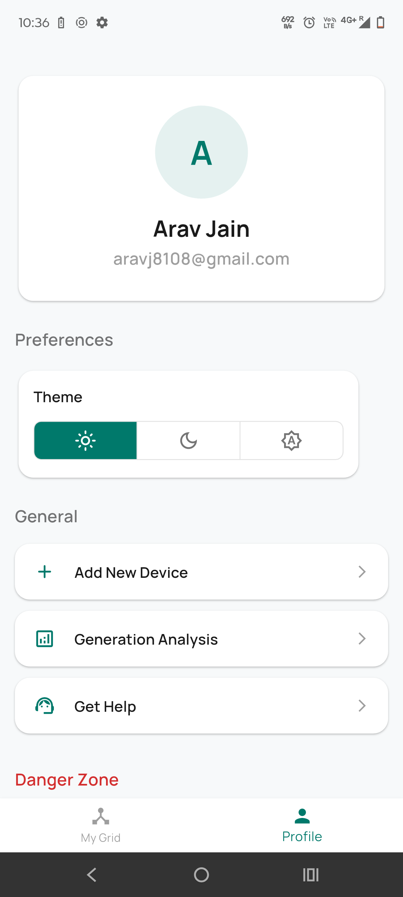
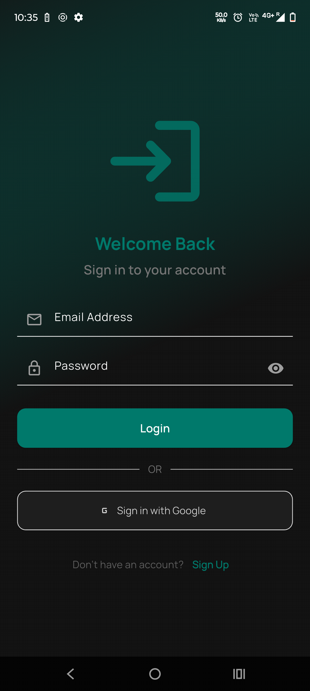
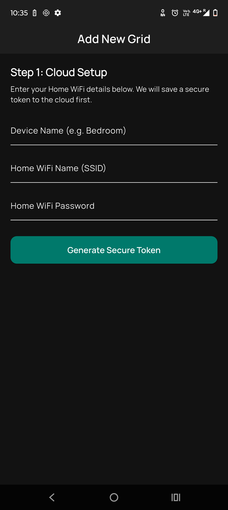
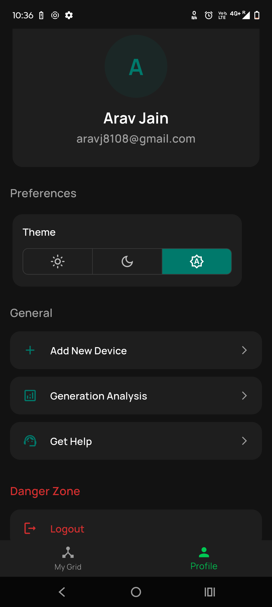
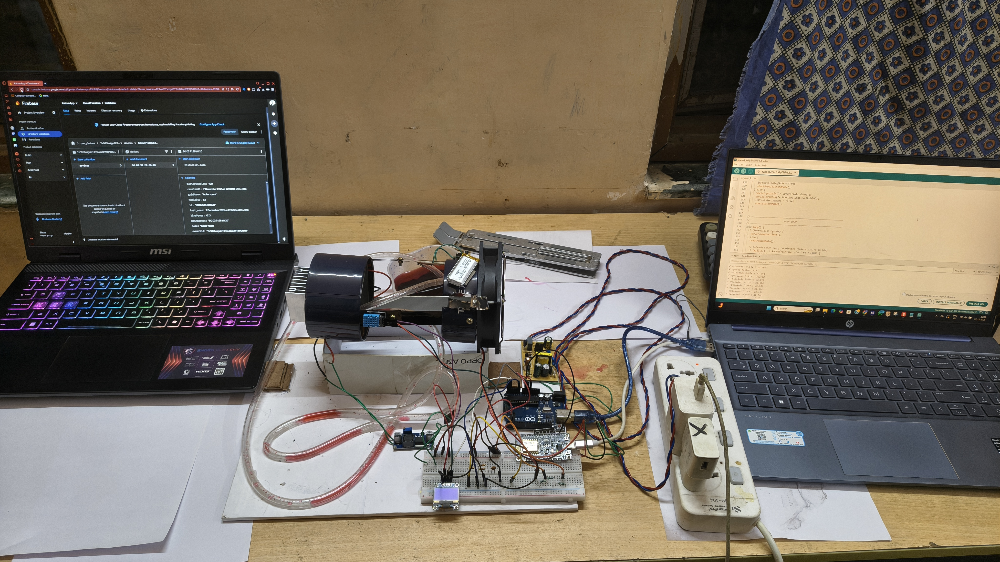

# Kaizen: Smart Grid & Energy Recovery System ⚡🌱


**Kaizen** is an IoT-enabled ecosystem designed to monitor, analyze, and optimize energy recovery systems. It combines a sleek, cross-platform mobile application with a robust serverless backend and ESP-based hardware to provide real-time telemetry on power generation, temperature, and humidity.

> *Kaizen (改善) is the Japanese philosophy of continuous improvement.*

---

## 📸 App Gallery

The app features a modern Material 3 design with comprehensive monitoring tools.

| **Dashboard** | **Analytics** | **Profile & Settings** |
|:---:|:---:|:---:|
|  |  |  |
| *Real-time grid status* | *Weekly yield analysis* | *User preferences* |

| **Secure Auth** | **Device Setup** | **Dark Mode** |
|:---:|:---:|:---:|
|  |  |  |
| *Email & Google Sign-in* | *SoftAP Provisioning* | *System-wide theming* |

---

## 🛠️ The Hardware

The system is powered by custom IoT nodes (ESP8266/ESP32) that capture environmental data and voltage readings.


*Prototype setup running on ESP NodeMCU*

---

## 🚀 Key Features

* **Real-Time Monitoring:** Live Websocket streams of Voltage (Power), Temperature, and Humidity via Firebase Firestore.
* **Smart Provisioning:** A secure "SoftAP" handshake mechanism to connect new IoT devices to the cloud without hardcoding WiFi credentials.
* **Historical Analysis:** Cloud Functions automatically aggregate live data into historical buckets for beautiful, interactive charts (Day/Week/Month).
* **Secure Authentication:** Full user management using Firebase Auth (Email/Password + Google OAuth) with email verification enforcement.
* **Themeable UI:** A modern Material 3 design with adaptive Light and Dark modes.

---

## 🏗️ Technical Architecture

Kaizen uses a **Token-Based Provisioning Protocol** to ensure security:

1. **Token Gen:** The App generates a secure `token` and saves it to Firestore linked to the `userId`.
2. **Handshake:** The App connects to the Device's Hotspot (`ESP32_Setup`) and passes the `token` + `Home WiFi Credentials`.
3. **Verification:** The Device connects to the internet and hits a **Firebase Cloud Function** (`exchangeToken`).
4. **Binding:** The Cloud Function verifies the token, creates the device record in the user's DB, and mints a **Custom Auth Token** for the device.
5. **Telemetry:** The device uses this token to write secure data directly to Firestore.

### Tech Stack

| Component | Technology | Description |
| :--- | :--- | :--- |
| **Frontend** | Flutter (Dart) | Provider state management, Fl_Chart, Google Fonts. |
| **Backend** | Firebase | Firestore (NoSQL), Cloud Functions (Node.js). |
| **Auth** | Firebase Auth | Custom Claims for IoT devices, OAuth for users. |
| **Firmware** | C++ / Arduino | Runs on ESP8266/ESP32 NodeMCU. |

---

## 💻 Getting Started

### Prerequisites

* Flutter SDK (3.0+)
* Firebase CLI
* Node.js (for Cloud Functions)

### 1. Clone the Repository

```bash
git clone https://github.com/yourusername/kaizen.git
cd kaizen
```

### 2. Frontend Setup

```bash
# Install dependencies
flutter pub get

# Run the app
flutter run
```

### 3. Backend Setup (Firebase)

Initialize Firebase in your project root:

```bash
firebase init
# Select Firestore, Functions, and Authentication
```

Deploy the security rules and Cloud Functions found in `/functions`:

```bash
cd functions
npm install
firebase deploy --only functions
```

### 4. Hardware Setup

* Open the `/firmware` folder (if applicable) in Arduino IDE or PlatformIO.
* Update the `API_ENDPOINT` to your Cloud Function URL.
* Flash to NodeMCU/ESP32.

---

## 📂 Project Structure

```
lib/
├── models/           # Data models (Grid, HistoricalData)
├── pages/            # UI Screens (Home, YieldAnalysis, AddDevice)
├── services/         # Logic (AuthService, ThemeProvider)
├── main.dart         # Entry point
└── ...
functions/
├── index.js          # Node.js backend logic (Token exchange, History logger)
└── ...
firmware/
├── src/
│   └── main.ino      # ESP8266/ESP32 firmware
└── platformio.ini    # Project configuration
```

---

## 🔐 Security & Best Practices

* Do not commit API keys or service account files to version control.
* Restrict Firestore rules so only authenticated users and registered devices can read/write.
* Use HTTPS for all device–cloud communication in production.
* Rotate tokens and credentials periodically.

---

## 🤝 Contributing

Contributions are welcome! Please fork the repository and submit a pull request for any features, bug fixes, or documentation improvements.

1. Fork the Project
2. Create your Feature Branch (`git checkout -b feature/AmazingFeature`)
3. Commit your Changes (`git commit -m 'Add some AmazingFeature'`)
4. Push to the Branch (`git push origin feature/AmazingFeature`)
5. Open a Pull Request

---

## 📄 License

Distributed under the MIT License. See `LICENSE` for more information.

---

**Developed with ❤️ by Sarthak Mehrishi**